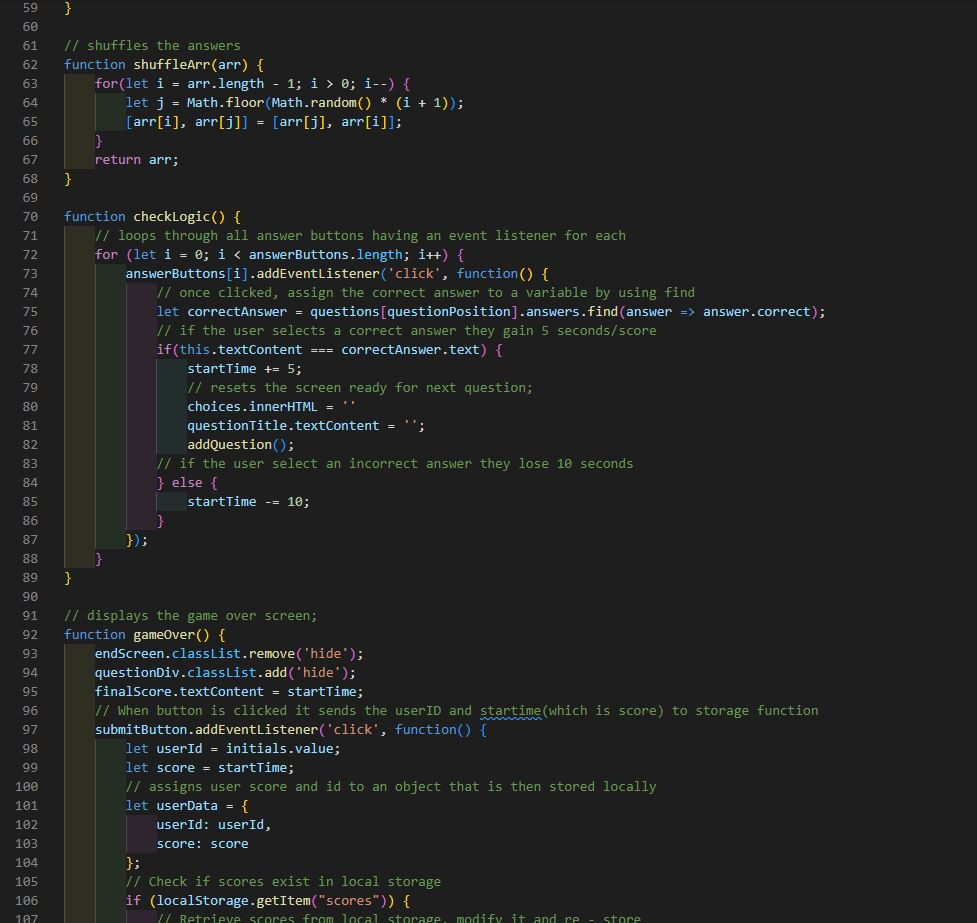
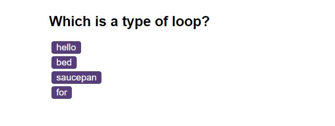

# Javascript quiz game

## Overview

A quiz game that tests your knowledge of javascript.

## Site & Repo
* [Site](https://dj-86.github.io/coding-quiz/)
* [Repo](https://github.com/DJ-86/coding-quiz)

## Acceptance Criteria
Create a code quiz that contains the following requirements:

* A start button that when clicked a timer starts and the first question appears.
  * Questions contain buttons for each answer.
  * When answer is clicked, the next question appears
  * If the answer clicked was incorrect then subtract time from the clock
* The quiz should end when all questions are answered or the timer reaches 0.
  * When the game ends, it should display their score and give the user the ability to save their initials and their score

## Resources:
* [find](https://developer.mozilla.org/en-US/docs/Web/JavaScript/Reference/Global_Objects/Array/find)
* [Fisher-Yates-Shuffle](https://www.tutorialspoint.com/what-is-fisher-yates-shuffle-in-javascript)
* [Local Storage](https://developer.mozilla.org/en-US/docs/Web/API/Window/localStorage);

## Screenshots
;

## License
* [MIT](LICENSE.md)
